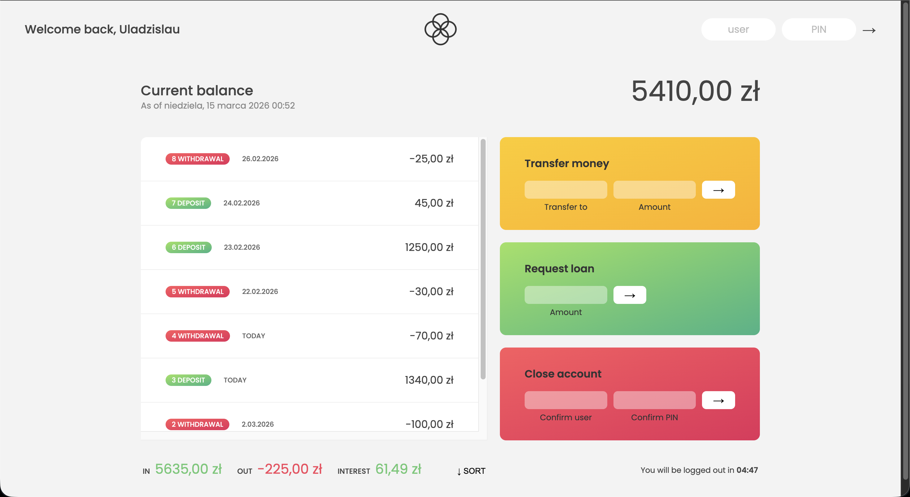

# 🏦 Bankist App | Advanced Data Structures

A modern, vanilla JavaScript banking application focused on complex data transformations, Internationalization (Intl), and dynamic UI rendering.

## 🔐 Demo Credentials

To test the application, log in using any of the following demo accounts:

- **User:** `js` | **PIN:** `1111` (Jonas Schmedtmann / EUR)
- **User:** `jd` | **PIN:** `2222` (Jessica Davis / USD)
- **User:** `un` | **PIN:** `3333` (Uladzislau Navitski / PLN)

## ✨ Custom Architecture & Improvements

While based on a standard concept, I heavily refactored the data structures and core logic to simulate a more realistic backend integration:

- **2D Array Data Structure:** Instead of keeping movements and dates in disconnected parallel arrays, I unified them into a structured 2D array: `[[amount, ISO_Date_String], ...]`. This prevents data desynchronization during sorting and filtering.
- **Non-mutating Sort (ES2023):** Implemented a 3-state sorting mechanism (Ascending, Descending, Original) using the modern `Array.prototype.toSorted()` method, fully preserving the original account data without creating manual shallow copies.
- **Declarative Callbacks:** Extracted callback functions (`deposit`, `withdrawal`) to make the chained array methods (`.filter(deposit).reduce(...)`) read like plain English.
- **Internationalization (Intl API):** Fully localized dates, currencies, and number formats based on the specific user's locale settings.

## ⚙️ Core Features

- **Money Transfers:** Securely send money to other users (validates balance and recipient).
- **Smart Loans:** Request a loan (approved only if the user has at least one previous deposit covering 10% of the requested amount).
- **Account Deletion:** Close the account permanently using credentials validation.
- **Security Timer:** Automatic UI lockout after 5 minutes of inactivity to protect user data.

## 🛠 Tech Stack

- **HTML5 & CSS3** (Grid, Flexbox, Opacity transitions)
- **Vanilla JavaScript** (ES6+, DOM API, HOFs, Intl API, Timers)

---

_Developed as part of deep JavaScript Core learning by [Uladzislau Navitski](https://www.linkedin.com/in/uladzislau-navitski/)_
